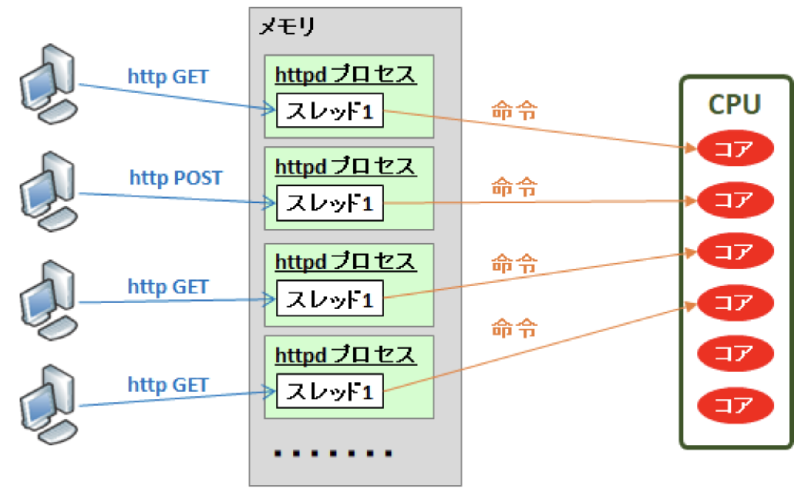
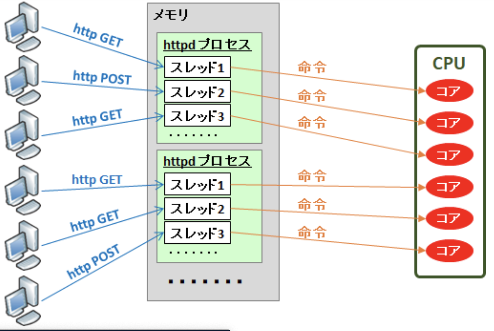

---

marp: true
theme: gradient

---

<!--
_pagenate: false
_title: Nginx & Apacheのチューニング
-->

# Apche & Nginx MPM

## 林良輝

---

# MPM(Multi Processing Module)について
`apache -V or httpd -V`
`/etc/httpd/conf.modules.d/00-mpm.conf`
`/etc/apache2/extra/httpd-mpm.conf`

## prefork
## worker
## event driven (イベント駆動)

---

<!--
_pagenate: true
_title_and_body: true
-->

# preforkとは

## シングルスレッドプロセスで複数のリクエストを処理する
## 1 つのプロセスが 1 つのスレッドを持つ。スレッドとは CPU に命令を渡す単位

---

<!--
_title_and_body: trues
-->

---

<!--
_pagenate: true
_title_and_body: true
-->

# workerとは

## マルチスレッドプロセスで複数のリクエストを処理する
##  1 つのプロセスが複数のスレッドを持つ

---

<!--
_pagenate: true
_title_and_body: true
-->

---

<!--
_pagenate: true
_title_and_body: true
-->

# event driven (イベント駆動) とは

## クライアントのアクセスをイベントとして扱い、それをトリガーにプロセス内で処理を行う

---

<!--
_pagenate: true
_title_and_body: true
-->

# ご静聴ありがとうございました。