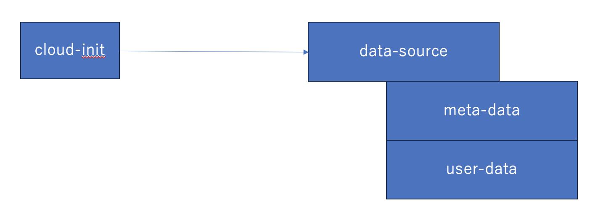

# cloud-init でサーバーをセットアップ

## 稲垣 孝洋

---

# 本発表の目的

- cloud-init を使ったサーバーセットアップについて具体的に知ってもらう
  - cloud-init を使うための基本的な要素を説明する

---

# cloud-init とは

主にクラウドのサーバーの起動時にサーバーの初期化を自動化するソフトウェア (ベアメタルでも使用可能)

- ホスト名を設定
- ユーザーを追加
- ssh の公開鍵を設定するなど
- ネットワークの設定
- パッケージをインストール
- などなど

---

# Ansible との棲み分け

- Ansible: ミドルウェアのセットアップ
  - 設定ファイルを生成する
- cloud-init: 基本的なセットアップ
  - ユーザー
  - ホスト名
  - パッケージのインストール
  - ネットワークの設定
  - など

cloud-init で基本的なセットアップをした後、Ansible で各種設定の流れ

---

# cloud-init の仕組み


何らかの方法でデータソースから meta-data, user-data を取得しその情報をもとにセットアップを行う

さくらのクラウドでは NoCloud という仕組みを利用して、meta-data, user-data を保存したディスクを挿し込むことで実現しています。

---

# meta-data について

クラウドプロバイダー(さくらのクラウド・AWS・GCP など)がサーバー起動時に渡すサーバー情報

クラウド側で採番されるサーバー ID やネットワークの情報などが入っている

- `ds.meta_data.Server.ID`
- `ds.meta_data.Server.Name`
- など

クラウドプロバイダーによって渡される情報は異なる
さくらのクラウドの場合
https://manual.sakura.ad.jp/cloud/server/cloud-init.html#metadata

---

# user-data について

クラウド利用者が指定するデータ

標準で用意されているモジュールを利用して各種設定を行う

---

```yaml
## template: jinja
#cloud-config

users: # ユーザーの設定を行うモジュール
  - default
  - name: inagaki # inagaki ユーザーを追加
    groups: [wheel]
    sudo:
      - "ALL=(ALL) NOPASSWD: ALL"
    shell: /bin/bash
    ssh_import_id:
      - gh:ophum # github.com/ophum.keysから公開鍵を取得

hostname: { { ds.meta_data.Server.Name } } # ホスト名をmeta-dataにあるサーバー名(クラウド上で設定した名前)にする
packages: # パッケージをインストールするモジュール
  - nginx # nginxをインストールする

write_files: # ファイルを作成するモジュール
  - path: /var/www/html/index.html # nginxのドキュメントルートのindex.htmlを作成する
    content: |
      hello ecc!
    permissions: "644"
```

---

# まとめ

- cloud-init について説明
- Ansible との棲み分けについて説明
- cloud-init の基本的な要素である meta-data, user-data について説明
