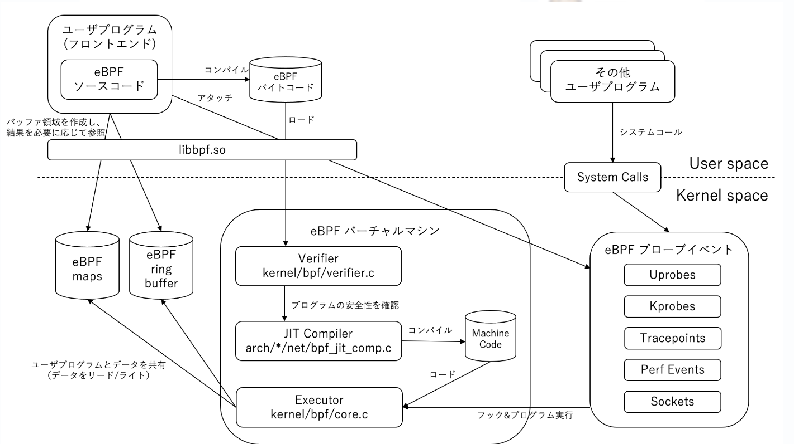

--- 

marp: true
theme: gradient

---     

# eBPF（Extended Berkeley Packet Filter） /  XDP (eXpress Data Path)
## 林 良輝

---

# アジェンダ
## - eBPFの歴史と現状
## - eBPF Architecture
## - XDPとは
## - まとめ

---

# eBPFの歴史と現状

```text

1990年代初頭に、、パケットをフィルタリングするためのフックと呼ばれる仕組みが存在していたが、
フックを使用するには、C言語でカーネルモジュールを記述する必要があった。
これは、カーネルモジュールの開発経験が必要なため、一般ユーザーにとっては困難だったため
フィルタリングプログラムを記述するための簡易な言語として BPF が開発された

```

```text

1992	最初のアイディアがバークレー研究所のSteven McCannの論文で発表
1997	Linuxカーネルv2.1.75でLinux Socket Filterという名称で初めてBPFが追加
2013	Alexei StarovoitovがcBPFの拡張を提案
2014	Linuxカーネルv3.18でeBPFが搭載
2015	BPF Compiler Collection (BCC) が開発
2019	Linuxカーネルv5.4でVerifierでforループが許可(ただしループ上限あり)
2019	CO-REプロジェクトの発表
2021	WindowsでeBPFサポートプロジェクトが発表される（uBPFのアプローチ）

```

---

# eBPF Architecture

---

## 処理フロー


---

# XDPとは

---

# まとめ

---

# 参考資料

- [eBPF 入門](hhttps://zenn.dev/hidenori3/articles/e1352e8cfeb2af)