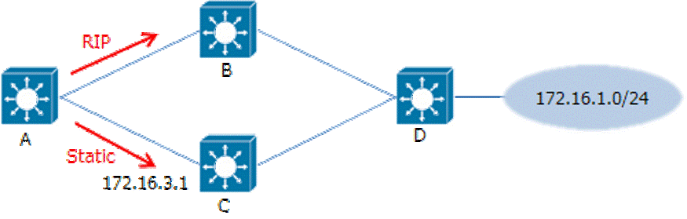
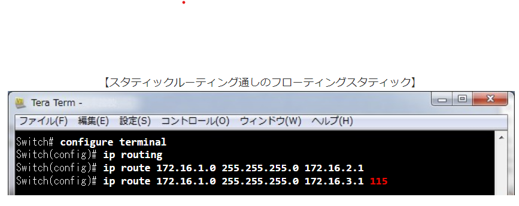
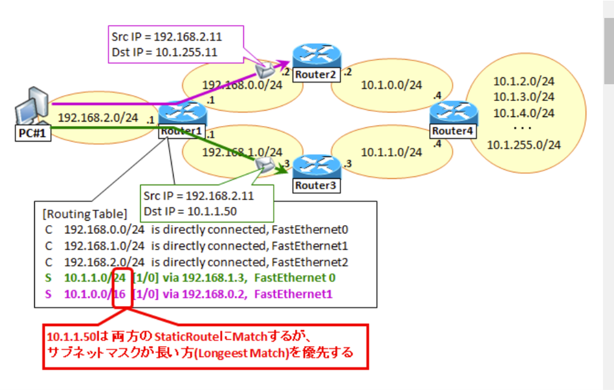
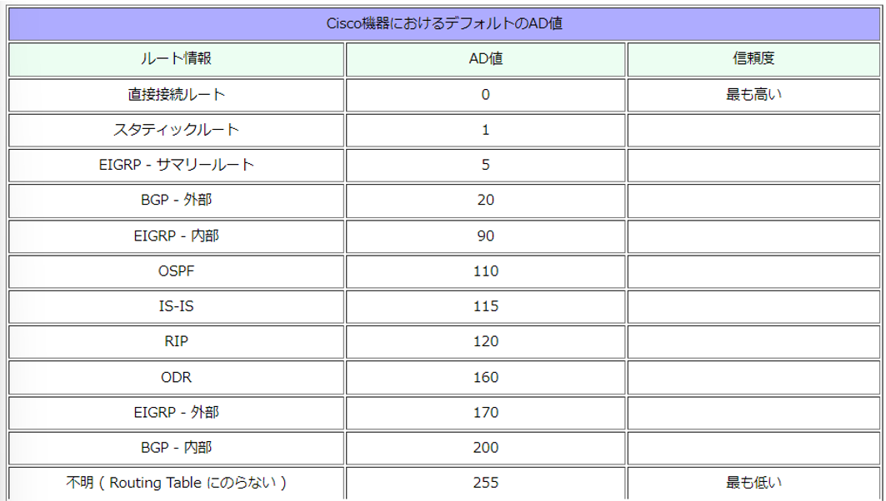

---

marp: true
theme: gaia

---

# フローティングスタティックルートについて

---

## フローティングスタティックルートとは

- ダイナミックルーティングプロトコルによりルート情報が
受信できなくなった場合に、AD値を調整したスタティックルートでトラフィックを救済する手法

---

## 実装例

- メイン回線とサブ回線がある

---

## 設定方法

- 赤い文字：
アドミニストレーティブディスタンス

---

## ルーティングテーブルの比較基準

1. ロンゲストマッチ
2. アドミニストレーティブディスタンス
3. メトリック

---

## ロンゲストマッチとは

---

## アドミニストレーティブディスタンスとは

---