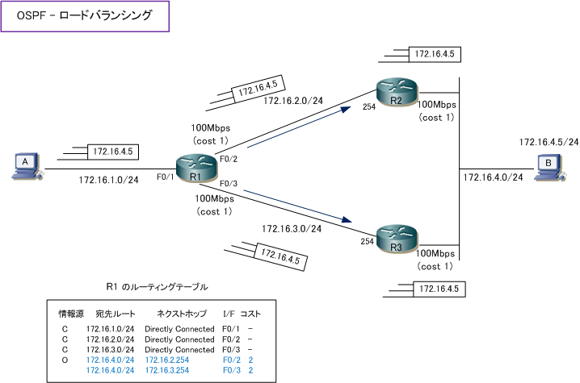
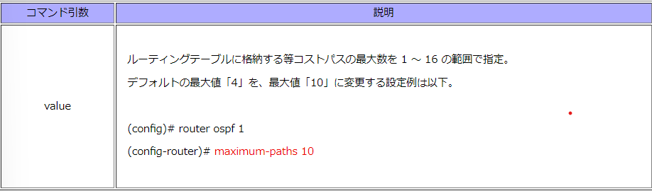
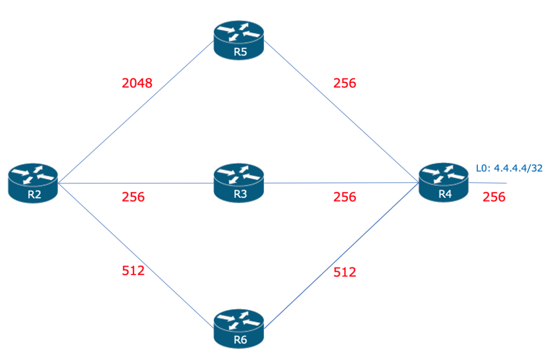
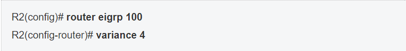
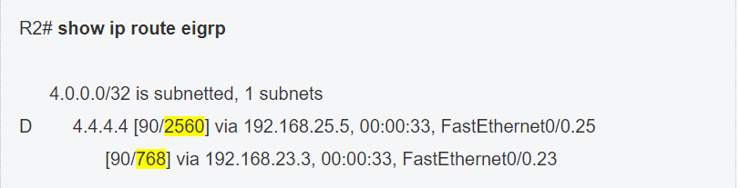

---

marp: true

---

# 不等コストロードバランシング

---

## 不等コストロードバランシングとは

- メトリックが等しくない値でも設定をすることにより負荷分散を実現できます。

---

## OSPFとEIGRPの違い(1)

- OSPFでは、ある宛先ネットワークに対して等コストである場合、複数のパスをルーティングテーブルに格納してトラフィックのロードバランシングをすることができます

---

## OSPFとEIGRPの違い(2)

- EIGRPでは、異なるメトリックの経路に対してもロードバランシングが実行できることです。

---

## 設定方法

---